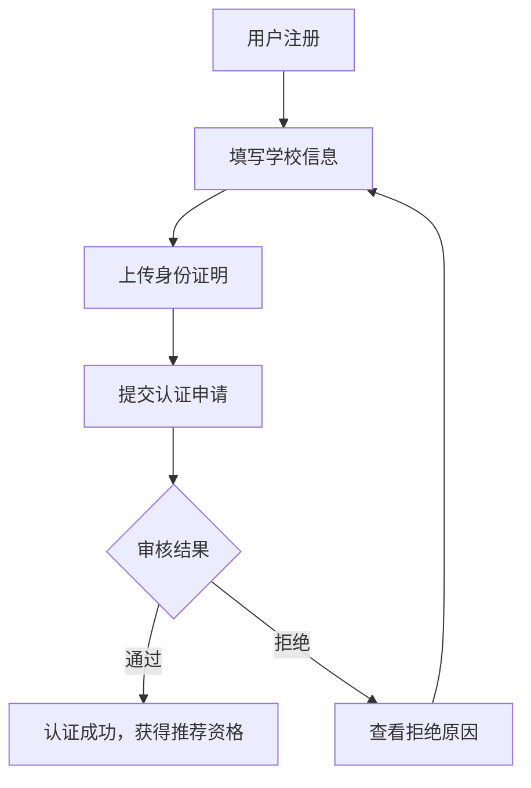
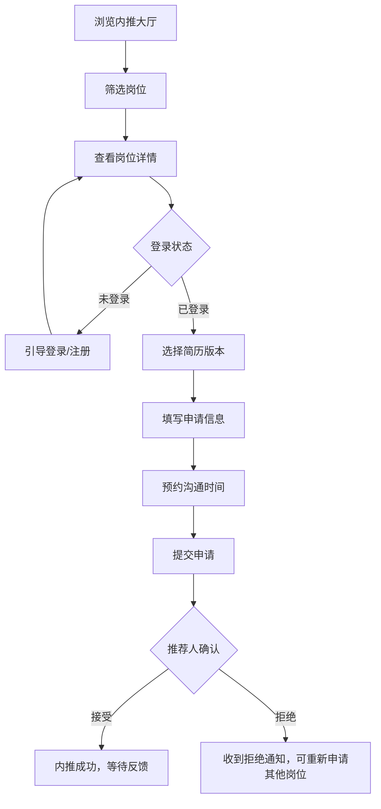
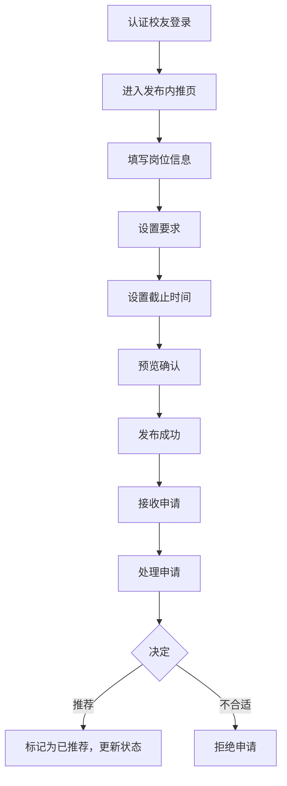

# 校友内推交换平台 - 产品需求文档

## 1. 产品概述

高校校友内推资源交换平台，连接即将毕业的学生与已就业的校友，实现实习和校招内推资源的精准匹配与共享。平台解决信息不对称问题，让内推资源在校友网络中高效流动。

**目标用户：** 高校毕业生（寻找实习/校招机会）、在校学生（提前储备机会）、已就业校友（回馈母校、拓展人脉）

**核心价值：** 打通校友内推信息壁垒，建立信任背书机制，让优质内推资源精准触达目标候选人。

---

## 2. 核心功能模块

### 2.1 用户角色

| 角色 | 注册方式 | 核心权限 |
|------|---------|---------|
| 求职校友 | 手机号/邮箱注册 | 浏览内推岗位、提交申请、管理简历 |
| 推荐校友 | 校友认证后升级 | 发布内推岗位、查看申请、处理内推 |
| 管理员 | 后台分配 | 用户管理、内容审核、数据统计 |

### 2.2 功能模块总览

1. **校友认证系统** - 学校信息验证、身份认证
2. **内推大厅** - 岗位列表、筛选、搜索
3. **岗位详情页** - 内推信息、推荐人信息、申请入口
4. **申请管理系统** - 申请记录、状态跟踪、沟通预约
5. **校友圈** - 面试经验分享、感谢信发布
6. **通知中心** - 截止提醒、申请状态变更、新内推推送
7. **个人中心** - 简历管理、屏蔽联系人设置

---

## 3. 页面详细设计

### 3.1 首页 (Home)

| 模块名称 | 功能描述 |
|---------|---------|
| 顶部导航 | Logo、导航菜单（首页/内推大厅/校友圈/通知/个人中心）、登录/注册按钮 |
| Hero区域 | 品牌标语、搜索框（关键词/公司/城市）、快速入口（发布内推/找内推） |
| 数据统计 | 认证校友数、累计内推数、成功内推数、覆盖城市数 |
| 热门内推 | 卡片式展示热门岗位，包含公司Logo、岗位名称、城市、截止时间 |
| 最新内推 | 时间线式展示最新发布岗位 |
| 校友圈精选 | 面试经验/感谢信精选展示 |
| 底部信息 | 平台介绍、联系方式、版权信息 |

### 3.2 校友认证页 (Certification)

| 模块名称 | 功能描述 |
|---------|---------|
| 认证引导 | 说明认证流程和认证后权益 |
| 学校选择 | 下拉选择学校（支持搜索） |
| 个人信息 | 姓名、学号/工号、毕业年份、院系、专业 |
| 身份证明 | 学信网验证/校友卡/工牌照片上传 |
| 认证状态 | 待审核/已通过/未通过 显示 |
| 认证权益 | 展示认证后可享受的功能 |

### 3.3 内推大厅页 (Referral Hall)

| 模块名称 | 功能描述 |
|---------|---------|
| 筛选栏 | 公司筛选、城市筛选、岗位类型筛选（实习/校招/社招）、截止时间筛选 |
| 排序选项 | 最新发布、截止时间、热度排序 |
| 岗位列表 | 卡片列表展示：岗位名称、公司Logo、公司名称、工作城市、岗位类型、年级要求、专业要求、截止时间、已申请人数 |
| 空状态 | 无匹配结果时的友好提示 |
| 分页/加载更多 | 列表分页或无限滚动加载 |

### 3.4 岗位详情页 (Job Detail)

| 模块名称 | 功能描述 |
|---------|---------|
| 岗位基础信息 | 岗位名称、公司名称、公司规模、所在城市、工作地点、岗位类型、薪资范围 |
| 内推信息 | 推荐人头像、姓名、年级、专业、入职公司、部门、职位、可接收简历范围说明 |
| 岗位要求 | 学历要求、年级要求、专业要求、技能要求、工作内容 |
| 截止时间 | 醒目展示截止日期 |
| 申请按钮 | 登录后可见/未登录引导登录 |
| 收藏功能 | 收藏岗位方便后续申请 |
| 分享功能 | 分享岗位给其他校友 |

### 3.5 申请管理页 (Application Management)

| 模块名称 | 功能描述 |
|---------|---------|
| 申请状态筛选 | 全部/待处理/已推荐/已拒绝/已完成 |
| 申请记录列表 | 岗位信息、申请时间、当前状态、推荐人信息 |
| 申请详情 | 申请材料（简历版本）、沟通记录、预约时间、状态变更历史 |
| 简历选择 | 从已保存简历版本中选择 |
| 沟通预约 | 选择预约沟通时间（日历选择） |
| 取消申请 | 取消尚未被处理的申请 |

### 3.6 发布内推页 (Post Referral)

| 模块名称 | 功能描述 |
|---------|---------|
| 岗位信息填写 | 岗位名称、公司名称、岗位类型、城市、工作地点、薪资范围 |
| 内推要求 | 年级要求、专业要求、技能要求、简历要求说明 |
| 截止时间 | 日期选择器 |
| 可接收范围 | 说明希望接收什么样的简历 |
| 联系方式 | 确认个人联系方式 |
| 预览发布 | 发布前预览效果 |

### 3.7 校友圈页 (Alumni Circle)

| 模块名称 | 功能描述 |
|---------|---------|
| 内容分类 | 面试经验/感谢信/内推感悟 |
| 发帖功能 | 富文本编辑器、图片上传、标签选择 |
| 帖子列表 | 瀑布流/卡片展示：标题、摘要、作者头像、发布时间、点赞数、评论数 |
| 帖子详情 | 完整内容、评论区、点赞功能 |
| 互动功能 | 评论、点赞、收藏、分享 |

### 3.8 通知中心页 (Notifications)

| 模块名称 | 功能描述 |
|---------|---------|
| 通知分类 | 全部/申请状态/截止提醒/新内推/系统通知 |
| 通知列表 | 时间线展示：通知图标、标题、内容摘要、时间 |
| 截止提醒 | 醒目颜色标识即将截止的岗位 |
| 已读/未读 | 未读通知标记、全部标为已读 |
| 通知详情 | 点击跳转相关页面 |

### 3.9 个人中心页 (Profile)

| 模块名称 | 功能描述 |
|---------|---------|
| 用户信息 | 头像、昵称、学校、年级、专业、认证状态 |
| 简历管理 | 上传简历、简历版本管理、设为默认简历 |
| 我发布的内推 | 查看已发布的内推岗位、管理（关闭/编辑） |
| 我收藏的岗位 | 收藏的内推岗位列表 |
| 屏蔽联系人 | 管理屏蔽的推荐人/求职者 |
| 设置 | 通知设置、隐私设置 |

---

## 4. 核心业务流程

### 4.1 校友认证流程

### 4.2 内推申请流程

### 4.3 发布内推流程

---

## 5. 用户界面设计

### 5.1 设计风格

- **视觉风格：** 专业可信、温暖友好、现代简洁
- **主色调：** 深蓝色 `#1E3A5F`（代表专业、信任），辅以橙色 `#F5A623`（代表活力、机会）
- **次要色：** 浅灰 `#F5F7FA`（背景）、深灰 `#2D3748`（正文）
- **成功色：** 绿色 `#38A169`
- **警告色：** 橙色 `#DD6B20`
- **错误色：** 红色 `#E53E3E`

### 5.2 字体选择

- **标题字体：** 思源黑体（Noto Sans SC）- Bold
- **正文字体：** 思源黑体（Noto Sans SC）- Regular
- **英文辅助：** Poppins

### 5.3 布局风格

- **桌面端：** 响应式栅格布局，固定侧边栏，1200px最大宽度
- **卡片式设计：** 圆角卡片，阴影悬浮效果
- **间距系统：** 基于4px的间距倍数，16px/24px/32px/48px

### 5.4 动画效果

- **页面切换：** 淡入淡出，300ms ease
- **卡片悬停：** 轻微上浮 + 阴影加深
- **按钮点击：** 轻微缩放反馈
- **列表加载：** 交错淡入动画
- **状态变更：** 颜色过渡动画

---

## 6. 数据统计指标

| 指标 | 描述 |
|------|------|
| 认证校友数 | 完成校友认证的用户总数 |
| 累计内推数 | 平台发布的内推岗位总数 |
| 成功内推数 | 状态为"已推荐"的申请总数 |
| 覆盖城市数 | 有内推岗位分布的城市数量 |
| 活跃用户数 | 近30天有操作的用户数 |

---

## 7. 页面清单汇总

| 页面名称 | 路由 | 核心功能 |
|---------|------|---------|
| 首页 | `/` | 品牌展示、搜索入口、热门内推 |
| 登录页 | `/login` | 用户登录 |
| 注册页 | `/register` | 用户注册 |
| 校友认证页 | `/certification` | 学校认证、身份验证 |
| 内推大厅 | `/referrals` | 岗位列表、筛选搜索 |
| 岗位详情 | `/referrals/:id` | 岗位详情、申请入口 |
| 发布内推 | `/referrals/post` | 发布新内推岗位 |
| 申请管理 | `/applications` | 我的申请、状态跟踪 |
| 校友圈 | `/circle` | 经验分享、感谢信 |
| 发帖页 | `/circle/post` | 发布新帖子 |
| 通知中心 | `/notifications` | 消息通知、截止提醒 |
| 个人中心 | `/profile` | 个人信息、简历管理 |
| 简历管理 | `/profile/resumes` | 简历上传、版本管理 |
| 屏蔽管理 | `/profile/blocks` | 屏蔽联系人管理 |

---

## 8. 非功能性需求

### 8.1 性能需求
- 页面首屏加载时间 < 3秒
- 接口响应时间 < 500ms
- 支持1000并发用户

### 8.2 安全需求
- 用户密码加密存储
- 敏感信息脱敏展示
- CSRF防护
- 输入数据校验

### 8.3 可用性需求
- 支持主流浏览器（Chrome、Firefox、Safari、Edge）
- 移动端适配（响应式设计）
- 断网友好提示
