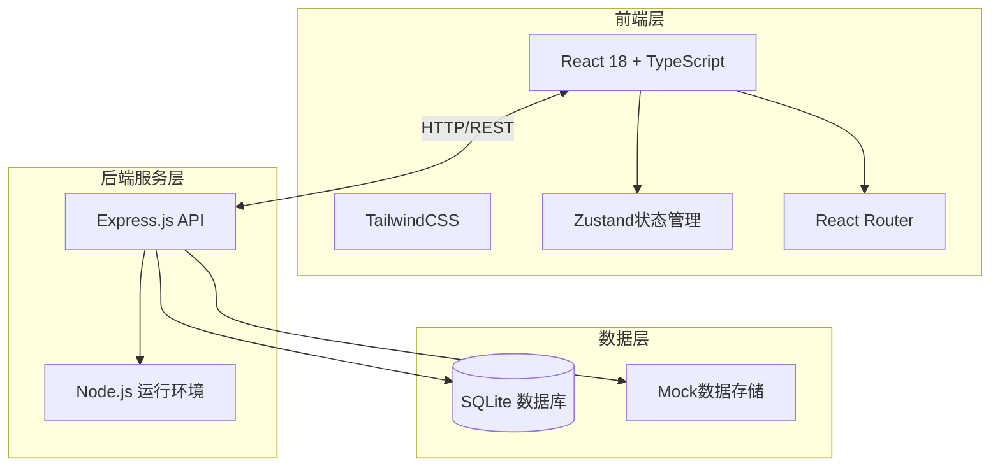
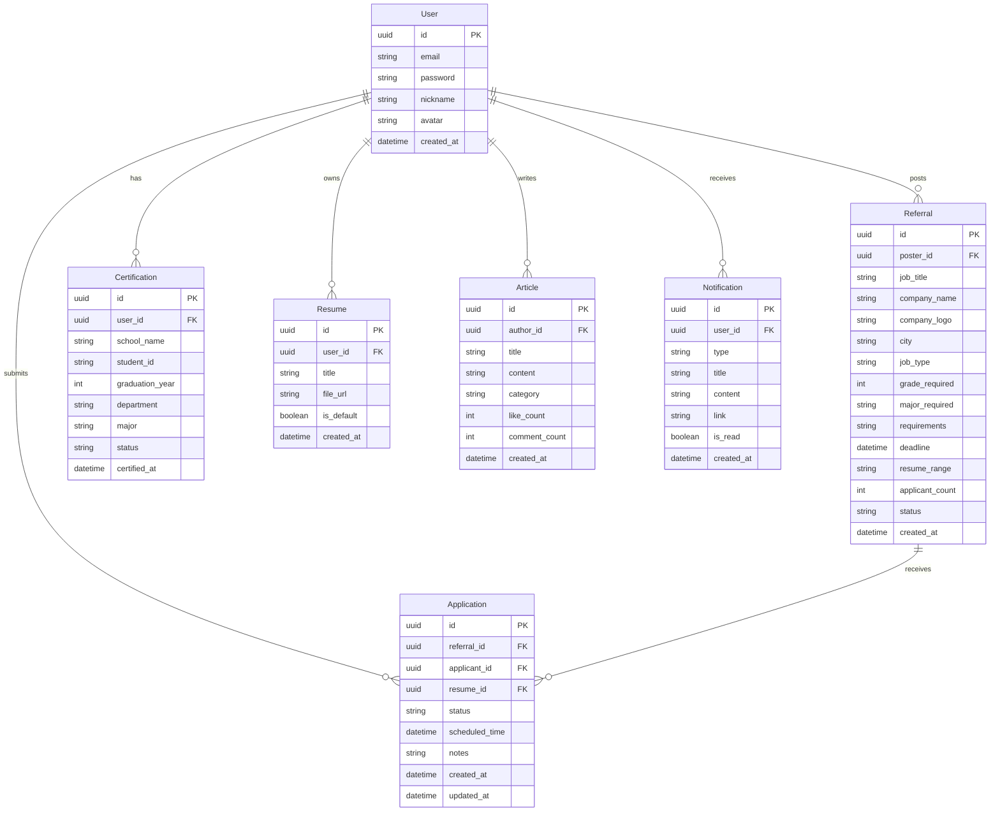

# 校友内推交换平台 - 技术架构文档

## 1. 架构设计



## 2. 技术栈说明

| 技术 | 版本 | 用途 |
|------|------|------|
| React | 18.x | 前端框架 |
| TypeScript | 5.x | 类型安全 |
| Vite | 5.x | 构建工具 |
| TailwindCSS | 3.x | 样式框架 |
| Zustand | 4.x | 状态管理 |
| React Router | 6.x | 路由管理 |
| Express | 4.x | 后端框架 |
| SQLite | 3.x | 数据库 |
| Lucide React | 最新 | 图标库 |

## 3. 路由定义

| 路由 | 页面组件 | 功能描述 |
|------|---------|---------|
| `/` | Home | 首页 |
| `/login` | Login | 登录页 |
| `/register` | Register | 注册页 |
| `/certification` | Certification | 校友认证 |
| `/referrals` | ReferralHall | 内推大厅 |
| `/referrals/:id` | JobDetail | 岗位详情 |
| `/referrals/post` | PostReferral | 发布内推 |
| `/applications` | Applications | 申请管理 |
| `/circle` | AlumniCircle | 校友圈 |
| `/circle/post` | PostArticle | 发帖页 |
| `/notifications` | Notifications | 通知中心 |
| `/profile` | Profile | 个人中心 |
| `/profile/resumes` | ResumeManagement | 简历管理 |
| `/profile/blocks` | BlockManagement | 屏蔽管理 |

## 4. 数据模型

### 4.1 数据模型关系图



### 4.2 数据类型定义

```typescript
// 用户类型
interface User {
  id: string;
  email: string;
  password: string;
  nickname: string;
  avatar: string;
  createdAt: Date;
}

// 校友认证
interface Certification {
  id: string;
  userId: string;
  schoolName: string;
  studentId: string;
  graduationYear: number;
  department: string;
  major: string;
  status: 'pending' | 'approved' | 'rejected';
  certifiedAt?: Date;
}

// 内推岗位
interface Referral {
  id: string;
  posterId: string;
  jobTitle: string;
  companyName: string;
  companyLogo: string;
  city: string;
  jobType: 'internship' | 'campus' | 'social';
  gradeRequired: number;
  majorRequired: string;
  requirements: string;
  deadline: Date;
  resumeRange: string;
  applicantCount: number;
  status: 'active' | 'closed' | 'expired';
  createdAt: Date;
}

// 申请记录
interface Application {
  id: string;
  referralId: string;
  applicantId: string;
  resumeId: string;
  status: 'pending' | 'recommended' | 'rejected' | 'completed';
  scheduledTime?: Date;
  notes: string;
  createdAt: Date;
  updatedAt: Date;
}

// 简历
interface Resume {
  id: string;
  userId: string;
  title: string;
  fileUrl: string;
  isDefault: boolean;
  createdAt: Date;
}

// 帖子
interface Article {
  id: string;
  authorId: string;
  title: string;
  content: string;
  category: 'experience' | 'thanks' | 'insight';
  likeCount: number;
  commentCount: number;
  createdAt: Date;
}

// 通知
interface Notification {
  id: string;
  userId: string;
  type: 'application' | 'deadline' | 'system' | 'new_referral';
  title: string;
  content: string;
  link?: string;
  isRead: boolean;
  createdAt: Date;
}
```

## 5. API 接口定义

### 5.1 认证接口

| 方法 | 路径 | 描述 | 请求体 | 响应 |
|------|------|------|--------|------|
| POST | `/api/auth/register` | 用户注册 | `{email, password, nickname}` | `{user, token}` |
| POST | `/api/auth/login` | 用户登录 | `{email, password}` | `{user, token}` |
| GET | `/api/auth/me` | 获取当前用户 | - | `{user}` |

### 5.2 认证接口

| 方法 | 路径 | 描述 | 请求体 | 响应 |
|------|------|------|--------|------|
| POST | `/api/certification` | 提交认证申请 | `{schoolName, studentId, graduationYear, department, major, proofImage}` | `{certification}` |
| GET | `/api/certification/status` | 获取认证状态 | - | `{certification}` |

### 5.3 内推接口

| 方法 | 路径 | 描述 | 请求体 | 响应 |
|------|------|------|--------|------|
| GET | `/api/referrals` | 获取内推列表 | `?city&jobType&grade&major&page&limit` | `{referrals, total, page}` |
| GET | `/api/referrals/:id` | 获取内推详情 | - | `{referral, poster}` |
| POST | `/api/referrals` | 发布内推 | `{jobTitle, companyName, city, ...}` | `{referral}` |
| PUT | `/api/referrals/:id` | 更新内推 | `{...updates}` | `{referral}` |
| DELETE | `/api/referrals/:id` | 删除内推 | - | `{success}` |

### 5.4 申请接口

| 方法 | 路径 | 描述 | 请求体 | 响应 |
|------|------|------|--------|------|
| GET | `/api/applications` | 获取我的申请 | `?status&page&limit` | `{applications, total}` |
| POST | `/api/applications` | 提交申请 | `{referralId, resumeId, notes}` | `{application}` |
| PUT | `/api/applications/:id` | 更新申请 | `{status, scheduledTime}` | `{application}` |
| DELETE | `/api/applications/:id` | 取消申请 | - | `{success}` |

### 5.5 简历接口

| 方法 | 路径 | 描述 | 请求体 | 响应 |
|------|------|------|--------|------|
| GET | `/api/resumes` | 获取简历列表 | - | `{resumes}` |
| POST | `/api/resumes` | 上传简历 | `{title, file}` | `{resume}` |
| PUT | `/api/resumes/:id` | 更新简历 | `{title, isDefault}` | `{resume}` |
| DELETE | `/api/resumes/:id` | 删除简历 | - | `{success}` |

### 5.6 校友圈接口

| 方法 | 路径 | 描述 | 请求体 | 响应 |
|------|------|------|--------|------|
| GET | `/api/articles` | 获取帖子列表 | `?category&page&limit` | `{articles, total}` |
| GET | `/api/articles/:id` | 获取帖子详情 | - | `{article, comments}` |
| POST | `/api/articles` | 发布帖子 | `{title, content, category}` | `{article}` |
| POST | `/api/articles/:id/like` | 点赞 | - | `{success}` |
| POST | `/api/articles/:id/comments` | 评论 | `{content}` | `{comment}` |

### 5.7 通知接口

| 方法 | 路径 | 描述 | 请求体 | 响应 |
|------|------|------|--------|------|
| GET | `/api/notifications` | 获取通知列表 | `?type&page&limit` | `{notifications, unreadCount}` |
| PUT | `/api/notifications/:id/read` | 标记已读 | - | `{success}` |
| PUT | `/api/notifications/read-all` | 全部标为已读 | - | `{success}` |

### 5.8 屏蔽接口

| 方法 | 路径 | 描述 | 请求体 | 响应 |
|------|------|------|--------|------|
| GET | `/api/blocks` | 获取屏蔽列表 | - | `{blocks}` |
| POST | `/api/blocks` | 添加屏蔽 | `{blockedUserId}` | `{block}` |
| DELETE | `/api/blocks/:id` | 取消屏蔽 | - | `{success}` |

## 6. 项目结构

```
c:\TraeProjects\1291
├── src/
│   ├── components/          # 通用组件
│   │   ├── layout/          # 布局组件
│   │   ├── common/          # 通用UI组件
│   │   └── forms/           # 表单组件
│   ├── pages/               # 页面组件
│   ├── hooks/               # 自定义Hook
│   ├── stores/              # Zustand状态管理
│   ├── services/            # API服务
│   ├── types/               # 类型定义
│   ├── utils/               # 工具函数
│   └── styles/              # 全局样式
├── api/                     # 后端代码
│   ├── routes/              # 路由
│   ├── services/            # 业务逻辑
│   ├── models/              # 数据模型
│   └── db/                  # 数据库
├── public/                  # 静态资源
└── shared/                  # 共享类型
```

## 7. 技术实现要点

### 7.1 前端状态管理

使用 Zustand 进行状态管理，按功能模块拆分store：
- `useAuthStore` - 用户认证状态
- `useReferralStore` - 内推数据缓存
- `useNotificationStore` - 通知状态
- `useUIStore` - UI状态（侧边栏、模态框等）

### 7.2 数据缓存策略

- 首页热门内推：缓存5分钟
- 内推详情：缓存10分钟
- 用户个人信息：缓存至手动刷新

### 7.3 表单验证

使用前端表单验证结合后端验证：
- 必填项检查
- 格式验证（邮箱、手机号）
- 自定义业务规则验证

### 7.4 响应式设计

采用移动优先的响应式设计：
- 移动端：单列布局，底部导航
- 平板端：两列布局
- 桌面端：多列布局，侧边导航
